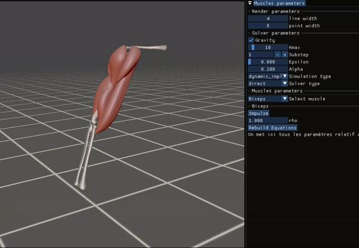

# Presentation

Simuscle is a code created to compute musculo-skeletal animation in real-time.



Here is more detailed information on the code on the [Simuscle website](https://simuscle.vercel.app/).

# Installation
***Dependency***: Simuscle required few basic libraries to be launch:
* C++ compiler
* Cmake
* OpenGL
* OpenCL

If all the library are correctly installed, you can download the repository and compile Simuscle with cmake:
```bash
cd Code
mkdir ./build
cd ./build
cmake ../
make install && cd ../
```

You can launch the example file with the folowing command:
```bash
./Simuscle Blender_example/Full_Arm_Simuscle/
```
